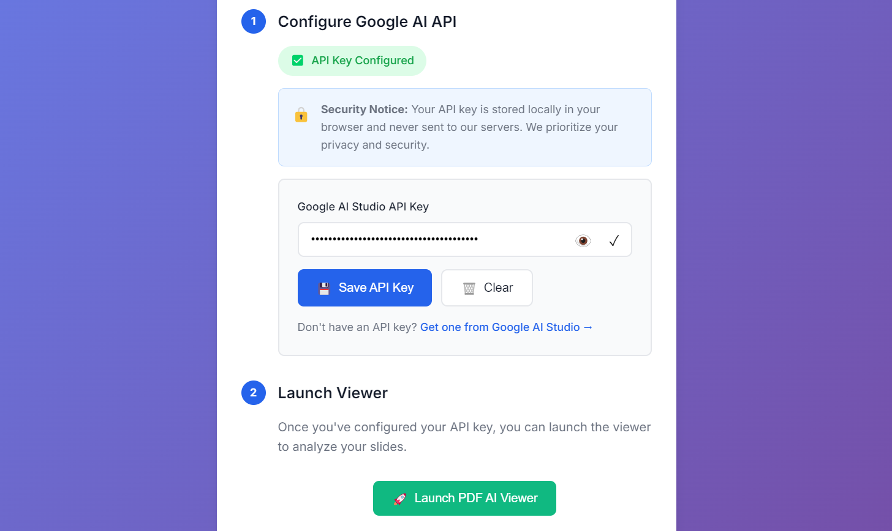
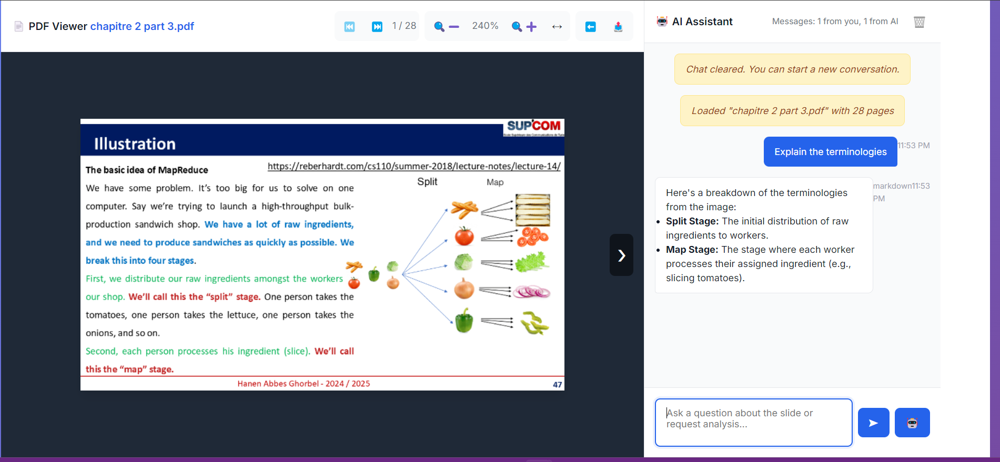

<a name="readme-top"></a>

<div align="center">

[![Contributors][contributors-shield]][contributors-url]
[![Forks][forks-shield]][forks-url]
[![Stargazers][stars-shield]][stars-url]
[![Issues][issues-shield]][issues-url]
[![MIT License][license-shield]][license-url]
[![LinkedIn][linkedin-shield]][linkedin-url]
[![Deploy][deploy-shield]][deploy-url]
</div>


<!-- PROJECT LOGO -->
<br />
<div align="center">
  <a href="https://chater-marzougui.github.io/Education-Help-Gemini">
    
  </a>
  <a href="https://chater-marzougui.github.io/Education-Help-Gemini">
    <h1 width="35px">PDF AI Viewer
    </h1>
  </a>
  <p align="center">
    A web-based PDF viewer with AI-powered slide analysis and explanation capabilities using Google's Gemini API.
    <br />
    <br />
    <a href="https://chater-marzougui.github.io/Education-Help-Gemini">View Demo</a>
    ·
    <a href="https://github.com/chater-marzougui/Education-Help-Gemini/issues/new?labels=bug&template=bug-report---.md">Report Bug</a>
    ·
    <a href="https://github.com/chater-marzougui/Education-Help-Gemini/issues/new?labels=enhancement&template=feature-request---.md">Request Feature</a>
  </p>
  
  <p align="center">
    
    
    
    
    
  </p>
</div>

<details>
  <summary>Table of Contents</summary>
  <ol>
    <li><a href="#features">Features</a></li>
    <li><a href="#how-it-works">How It Works</a></li>
    <li><a href="#getting-started">Getting Started</a></li>
    <li><a href="#usage-guide">Usage Guide</a></li>
    <li><a href="#technical-details">Technical Details</a></li>
    <li><a href="#deployment">Deployment</a></li>
    <li><a href="#privacy--security">Privacy & Security</a></li>
    <li><a href="#troubleshooting">Troubleshooting</a></li>
    <li><a href="#contributing">Contributing</a></li>
    <li><a href="#documentation">Documentation</a></li>
    <li><a href="#license">License</a></li>
    <li><a href="#contact">Contact</a></li>
    <li><a href="#acknowledgments">Acknowledgments</a></li>
  </ol>
</details>

## Features

- ✅ **Type-Safe**: Built with TypeScript for reliability and maintainability
- 🎨 **Modern UI**: Beautiful interface using Tailwind CSS and shadcn/ui components
- 🔍 **SEO Optimized**: Comprehensive SEO with meta tags, Open Graph, and Twitter Cards
- 🎭 **Branded**: Professional logo and consistent branding across all pages
- 📄 **PDF Viewing**: Open and navigate through PDF documents with intuitive controls
- 🤖 **AI Analysis**: Get instant explanations of slides using Gemini AI
- 💬 **Interactive Chat**: Ask questions about the PDF content and receive AI-powered responses
- 📱 **Responsive Design**: Works on desktop and mobile devices
- ⌨️ **Keyboard Shortcuts**: Navigate efficiently with keyboard controls
- 🎯 **User-Friendly Controls**: Zoom, pan, navigate, and interact with PDF pages easily
- 🔒 **Privacy-First**: API keys stored locally in browser, never sent to our servers
- 🌐 **PWA Ready**: Installable as a Progressive Web App

<p align="right">(<a href="#readme-top">back to top</a>)</p>

## How It Works

1. **Upload your PDF**: Drag and drop or browse to select a PDF document
2. **Navigate the document**: Use intuitive controls to move through pages, zoom, and pan
3. **Analyze slides**: Click the AI button to get an explanation of the current slide
4. **Ask questions**: Chat with the AI assistant about the content of your document

<div align="center">
  
</div>
<br />
<div align="center">
  
</div>

<p align="right">(<a href="#readme-top">back to top</a>)</p>

## Getting Started

### Prerequisites

- Node.js 18 or higher
- npm or yarn
- A modern web browser (Chrome, Firefox, Safari, Edge)
- Google AI Studio API key ([Get one here](https://aistudio.google.com/app/apikey))

### Setup Instructions

#### 1. Get a Google AI Studio API Key

1. Visit [Google AI Studio](https://aistudio.google.com/app/apikey)
2. Create or sign in to your Google account
3. Generate a new API key
4. Copy the API key (it starts with "AIza...")

#### 2. Launch the Application

##### Option A: Using the hosted version (Recommended)
1. Navigate to [PDF AI Viewer](https://chater-marzougui.github.io/Education-Help-Gemini)
2. Enter your Google AI Studio API key when prompted
3. Upload your PDF and start exploring!

##### Option B: Local Development
1. Clone this repository:
   ```bash
   git clone https://github.com/chater-marzougui/Education-Help-Gemini.git
   cd Education-Help-Gemini/Gemini_PDF_Helper
   ```

2. Install dependencies:
   ```bash
   npm install
   ```

3. Start the development server:
   ```bash
   npm run dev
   ```

4. Open your browser and navigate to `http://localhost:5173/Education-Help-Gemini/`

5. Enter your Google AI Studio API key and start exploring!

<p align="right">(<a href="#readme-top">back to top</a>)</p>

## Usage Guide

### Getting Started with the App

1. **Configure API Key**: Enter your Google AI Studio API key on the setup page
2. **Upload PDF**: Drag and drop or select a PDF file (max 50MB)
3. **Navigate**: Use controls or keyboard shortcuts to navigate pages
4. **Analyze**: Click the AI button to analyze the current slide
5. **Ask Questions**: Use the chat interface to ask questions about the content

### PDF Navigation

- **Previous/Next Page**: Click the arrow buttons or use keyboard arrow keys (← / →)
- **Zoom In/Out**: Use the zoom buttons or +/- keys
- **Fit to Width**: Click the width adjustment button
- **Pan**: Click and drag to move around the page
- **First/Last Page**: Use Home/End keys

### AI Features

- **Analyze Current Slide**: Click the robot icon or press Enter to get an explanation of the current page
- **Ask Questions**: Type your question in the chat box and press Enter
- **Clear Chat**: Click the trash icon to start a new conversation

### Keyboard Shortcuts

- `←` / `→` - Previous/Next page
- `Enter` - Analyze current slide
- `+` / `-` - Zoom in/out (when not typing)
- `Home` / `End` - First/Last page

<p align="right">(<a href="#readme-top">back to top</a>)</p>

## Technical Details

Built with modern web technologies for a fast and reliable experience.

### Tech Stack

- **React 19** - UI Framework
- **TypeScript** - Type safety and better developer experience
- **React Router** - Client-side routing for multi-page experience
- **Vite** - Lightning-fast build tool and dev server
- **Tailwind CSS** - Utility-first styling
- **shadcn/ui** - Beautiful and accessible UI components
- **PDF.js** - Robust PDF rendering
- **React Markdown** - Markdown rendering for AI responses
- **Gemini 2.0 Flash** - Google's latest AI model for analysis

### Project Structure

```
Education-Help-Gemini/
├── Gemini_PDF_Helper/
│   ├── src/
│   │   ├── pages/
│   │   │   ├── SetupPage.tsx           # API key setup (/)
│   │   │   ├── UploadPage.tsx          # PDF upload (/upload)
│   │   │   └── ViewerPage.tsx          # PDF viewer (/viewer)
│   │   ├── components/
│   │   │   ├── app/
│   │   │   │   ├── Logo.tsx            # Brand logo
│   │   │   │   ├── SEO.tsx             # SEO meta tags
│   │   │   │   ├── ApiKeySetup.tsx     # API key configuration
│   │   │   │   ├── FileUpload.tsx      # PDF file upload
│   │   │   │   ├── PDFViewer.tsx       # PDF rendering
│   │   │   │   └── ChatInterface.tsx   # AI chat
│   │   │   └── ui/                     # shadcn/ui components
│   │   ├── hooks/
│   │   │   └── useLocalStorage.ts      # localStorage hook
│   │   ├── services/
│   │   │   └── gemini.ts               # Gemini API integration
│   │   ├── types/
│   │   │   └── index.ts                # TypeScript types
│   │   ├── App.tsx                     # Main router
│   │   └── main.tsx                    # Entry point
│   ├── .github/
│   │   └── workflows/
│   │       └── deploy.yml              # Auto-deployment
│   ├── public/
│   │   ├── assets/                     # Images and logos
│   │   ├── robots.txt                  # SEO
│   │   ├── sitemap.xml                 # SEO
│   │   └── manifest.json               # PWA
│   ├── package.json
│   ├── vite.config.ts
│   └── tsconfig.json
├── assets/
│   ├── logo.png
│   ├── screenshot1.png
│   └── screenshot2.png
├── LICENSE
└── README.md
```

### Routing

The application uses React Router with three main routes:

- **`/`** - Setup page for API key configuration
- **`/upload`** - File upload page
- **`/viewer`** - PDF viewer with AI chat interface

Navigation is automatic based on your progress through the workflow.

<p align="right">(<a href="#readme-top">back to top</a>)</p>

## Deployment

The application features **automated deployment** to GitHub Pages using GitHub Actions.

### Automatic Deployment
Every push to the `main` branch automatically triggers a build and deployment:

```bash
git add .
git commit -m "Your commit message"
git push origin main
```

The site will be automatically deployed to: [https://chater-marzougui.github.io/Education-Help-Gemini/](https://chater-marzougui.github.io/Education-Help-Gemini/)

### Manual Deployment
You can also trigger deployment manually:
1. Go to the **Actions** tab on GitHub
2. Select "Deploy to GitHub Pages"
3. Click "Run workflow"

For detailed deployment instructions, see [DEPLOYMENT.md](./Gemini_PDF_Helper/DEPLOYMENT.md)

### Building for Production

```bash
cd Gemini_PDF_Helper
npm run build
```

The built files will be in the `dist` directory.

<p align="right">(<a href="#readme-top">back to top</a>)</p>

## Privacy & Security

- ✅ Your PDF files are processed **completely in your browser** - never uploaded to any server
- ✅ Your API key is stored locally in your browser's localStorage
- ✅ No data is collected or shared with third parties
- ✅ All processing happens client-side for maximum privacy
- ✅ HTTPS encryption on GitHub Pages

<p align="right">(<a href="#readme-top">back to top</a>)</p>

## Limitations

- Large PDFs (>50MB) may impact browser performance
- AI analysis works best with clear, well-structured slides
- Requires an internet connection for AI functionality
- API rate limits apply based on your Google AI Studio plan

## Troubleshooting

### Common Issues

**Issue**: API key not being accepted  
**Solution**: 
- Verify your key is correct and starts with "AIza..."
- Ensure it has permissions for Gemini 2.0 Flash
- Check that the API key is active in Google AI Studio

**Issue**: PDF fails to load  
**Solution**: 
- Ensure your PDF is not corrupted
- Try a different PDF to test
- Check file size (max 50MB recommended)
- Verify PDF is not password-protected

**Issue**: Slow performance with large PDFs  
**Solution**: 
- Try a smaller PDF or reduce the zoom level
- Close other browser tabs to free up memory
- Use Chrome or Edge for best performance

**Issue**: Routes not working after deployment  
**Solution**: 
- ✅ Already configured! The 404.html handles this automatically
- Clear browser cache if needed

**Issue**: Build fails locally  
**Solution**:
```bash
# Clear cache and reinstall
rm -rf node_modules package-lock.json
npm install
npm run build
```

For more help, check the [DEPLOYMENT.md](./Gemini_PDF_Helper/DEPLOYMENT.md) guide or [open an issue](https://github.com/chater-marzougui/Education-Help-Gemini/issues).

<p align="right">(<a href="#readme-top">back to top</a>)</p>

## Contributing

Contributions are welcome! We appreciate your help in making this project better.

### How to Contribute

1. **Fork the repository**
2. **Clone your fork**
   ```bash
   git clone https://github.com/YOUR-USERNAME/Education-Help-Gemini.git
   cd Education-Help-Gemini/Gemini_PDF_Helper
   ```
3. **Create a feature branch**
   ```bash
   git checkout -b feature/amazing-feature
   ```
4. **Make your changes and test**
   ```bash
   npm install
   npm run dev
   npm run build
   ```
5. **Commit your changes**
   ```bash
   git commit -m 'feat: add amazing feature'
   ```
6. **Push to your fork**
   ```bash
   git push origin feature/amazing-feature
   ```
7. **Open a Pull Request** on GitHub

### Development Guidelines

- Write clean, documented code
- Follow TypeScript best practices
- Test your changes locally before submitting
- Update documentation if needed
- Keep commits focused and atomic

<p align="right">(<a href="#readme-top">back to top</a>)</p>

## License

This project is licensed under the MIT License - see the LICENSE file for details.

<p align="right">(<a href="#readme-top">back to top</a>)</p>

## Contact

- Chater Marzougui - [@Chater-marzougui](linkedin-url) - chater.mrezgui2002@gmail.com <br/>

<p align="right">(<a href="#readme-top">back to top</a>)</p>

## Documentation

Additional documentation is available in the `Gemini_PDF_Helper` folder:

- 📚 [Quick Start Guide](./Gemini_PDF_Helper/QUICKSTART.md) - Get started in 5 minutes
- 🚀 [Deployment Guide](./Gemini_PDF_Helper/DEPLOYMENT.md) - Comprehensive deployment instructions
- 🔍 [SEO Implementation](./Gemini_PDF_Helper/SEO_IMPLEMENTATION.md) - SEO strategy and best practices
- 🎨 [Visual Design Guide](./Gemini_PDF_Helper/VISUAL_DESIGN.md) - UI/UX documentation
- 🛣️ [Router Implementation](./Gemini_PDF_Helper/ROUTER_CHANGES.md) - Routing architecture
- 🎭 [Logo & Branding](./Gemini_PDF_Helper/LOGO_SEO_CHANGES.md) - Branding implementation

<p align="right">(<a href="#readme-top">back to top</a>)</p>

## Acknowledgments

- [Google Gemini API](https://ai.google.dev/) for the powerful AI capabilities
- [PDF.js](https://mozilla.github.io/pdf.js/) for robust PDF rendering
- [React](https://react.dev/) for the amazing UI framework
- [Vite](https://vitejs.dev/) for the blazing-fast build tool
- [shadcn/ui](https://ui.shadcn.com/) for beautiful and accessible components
- [Tailwind CSS](https://tailwindcss.com/) for utility-first styling
- [React Markdown](https://github.com/remarkjs/react-markdown) for markdown rendering

[contributors-shield]: https://img.shields.io/github/contributors/chater-marzougui/Education-Help-Gemini.svg?style=for-the-badge
[contributors-url]: https://github.com/chater-marzougui/Education-Help-Gemini/graphs/contributors
[forks-shield]: https://img.shields.io/github/forks/chater-marzougui/Education-Help-Gemini.svg?style=for-the-badge
[forks-url]: https://github.com/chater-marzougui/Education-Help-Gemini/network/members
[stars-shield]: https://img.shields.io/github/stars/chater-marzougui/Education-Help-Gemini.svg?style=for-the-badge
[stars-url]: https://github.com/chater-marzougui/Education-Help-Gemini/stargazers
[issues-shield]: https://img.shields.io/github/issues/chater-marzougui/Education-Help-Gemini.svg?style=for-the-badge
[issues-url]: https://github.com/chater-marzougui/Education-Help-Gemini/issues
[license-shield]: https://img.shields.io/github/license/chater-marzougui/Education-Help-Gemini.svg?style=for-the-badge
[license-url]: https://github.com/chater-marzougui/Education-Help-Gemini/blob/main/LICENSE
[linkedin-shield]: https://img.shields.io/badge/-LinkedIn-black.svg?style=for-the-badge&logo=linkedin&colorB=555
[linkedin-url]: https://linkedin.com/in/chater-marzougui-342125299
[deploy-shield]: https://img.shields.io/github/actions/workflow/status/chater-marzougui/Education-Help-Gemini/deploy.yml?branch=main&style=for-the-badge&label=Deploy
[deploy-url]: https://github.com/chater-marzougui/Education-Help-Gemini/actions/workflows/deploy.yml